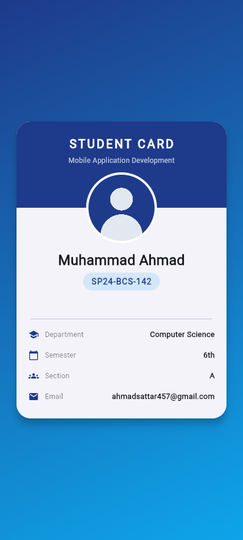
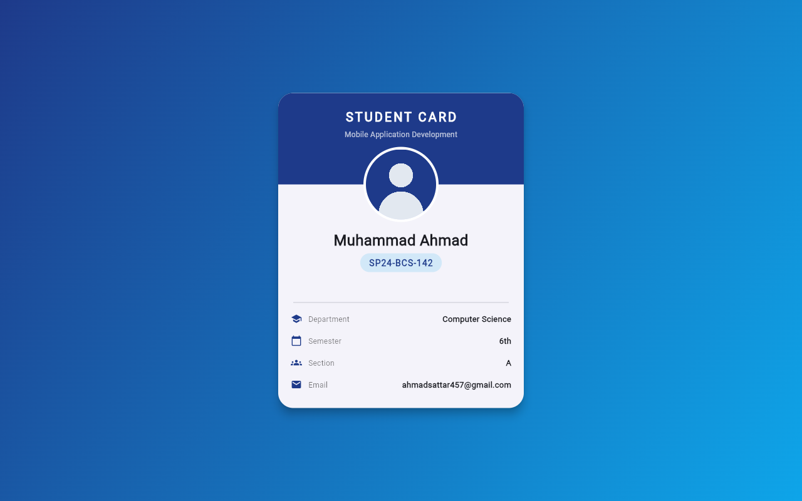

# Assignment 2 — Student Card App

CSC303 Mobile Application Development (CLO-3)

Flutter app that displays a student card with photo, name, registration number,
department, semester, section and email.

**Muhammad Ahmad — SP24-BCS-142 — Computer Science — 6th Semester**

## Contents

| Path | What |
|---|---|
| `lib/main.dart` | The app. Student details live in the `student` map at the top. |
| `assets/images/student.png` | Student photo |
| `pubspec.yaml` | Dependencies and asset registration |
| `screenshots/` | Screenshots of the running app |

## Screenshots

| Phone | Desktop |
|---|---|
|  |  |

## Run

```bash
flutter pub get
flutter run
```
